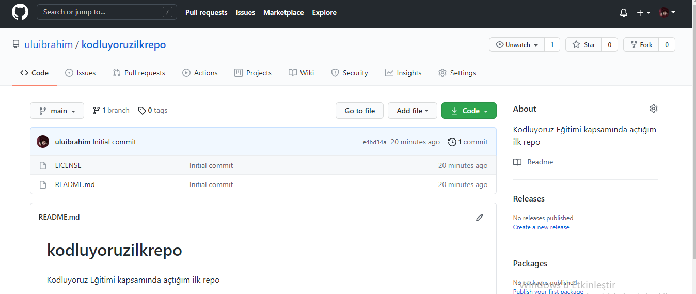

# kodluyoruzilkrepo
Kodluyoruz Eğitimi kapsamında açtığım ilk repo.


---


## Installation
---
Öncelikle projeyi clonelayın

```
 git clone https://github.com/uluibrahim/kodluyoruzilkrepo.git
```
## usage
---

Projeyi cloneladıktan sonra Visual Studio Code programında açınız.

Windows için:

```
cd kodluyoruzilkrepo
code .
```

## Contributing
---
Pull requestler kabul edilir. Büyük değişiklikler için, lütfen önce neyi değiştirmek istediğinizi tartışmak için bir konu açınız.
## License
---
[MIT](https://choosealicense.com/licenses/mit/)